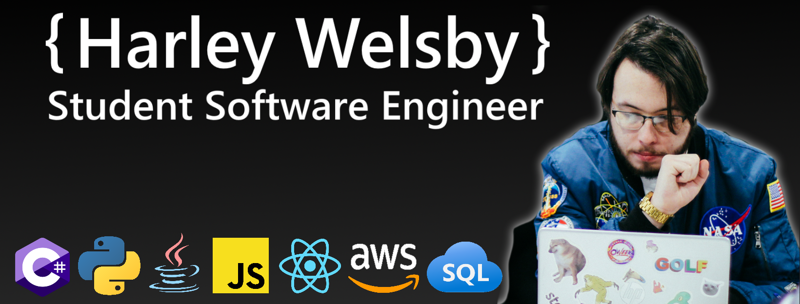

<!---->

## Harley Welsby
Hi! I'm Harley, a Full-Stack .NET Developer from New Zealand.
I'm also studying Bachelor of Engineering (Hons) in my third year, majoring in Software Engineering.

I'm always looking to meet people and love to engage with the Engineering and Computer Science community, so feel free to reach out to me at any of the links below:
  
<a href="https://www.linkedin.com/in/harleywelsby/" target="_blank">
 
<a/>
 
<!--
**harleywelsby/harleywelsby** is a ✨ _special_ ✨ repository because its `README.md` (this file) appears on your GitHub profile.

Here are some ideas to get you started:

- 🔭 I’m currently working on ...
- 🌱 I’m currently learning ...
- 👯 I’m looking to collaborate on ...
- 🤔 I’m looking for help with ...
- 💬 Ask me about ...
- 📫 How to reach me: ...
- 😄 Pronouns: ...
- ⚡ Fun fact: ...
-->
